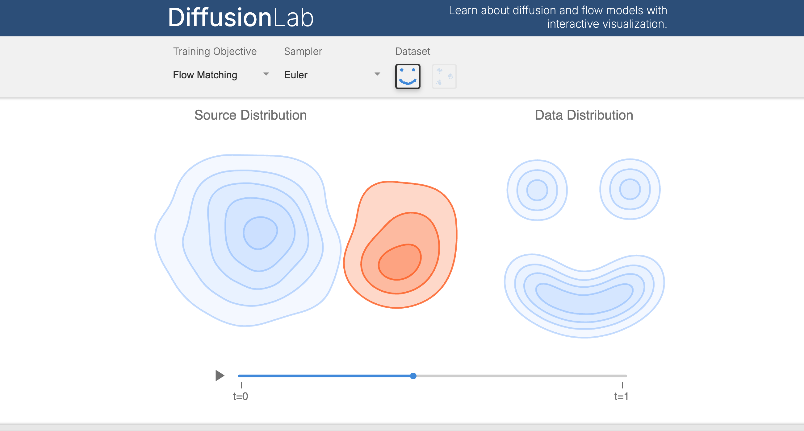

# DiffusionLab: Interactive Visualizations of Diffusion and Flow Based Generative Models



---

DiffusionLab is an interactive tool (check out a beta version [here](alechelbling.com/DiffusionLab)) for communicating the geometric intuitions behind diffusion and flow based generative models. This project is currently a work in progress. 

### Try Out DiffusionLab Locally

You can try out DiffusionLab locally by running the project:
```
    git clone https://github.com/helblazer811/DiffusionLab
    cd diffusion-lab
    npm run dev
```
and then access it in your browser at the specified port. 

### Other Visualizations

You can also see some other interesting (non-interactive) visualizations in `/other-visualizations`. 